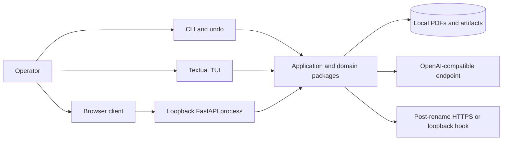
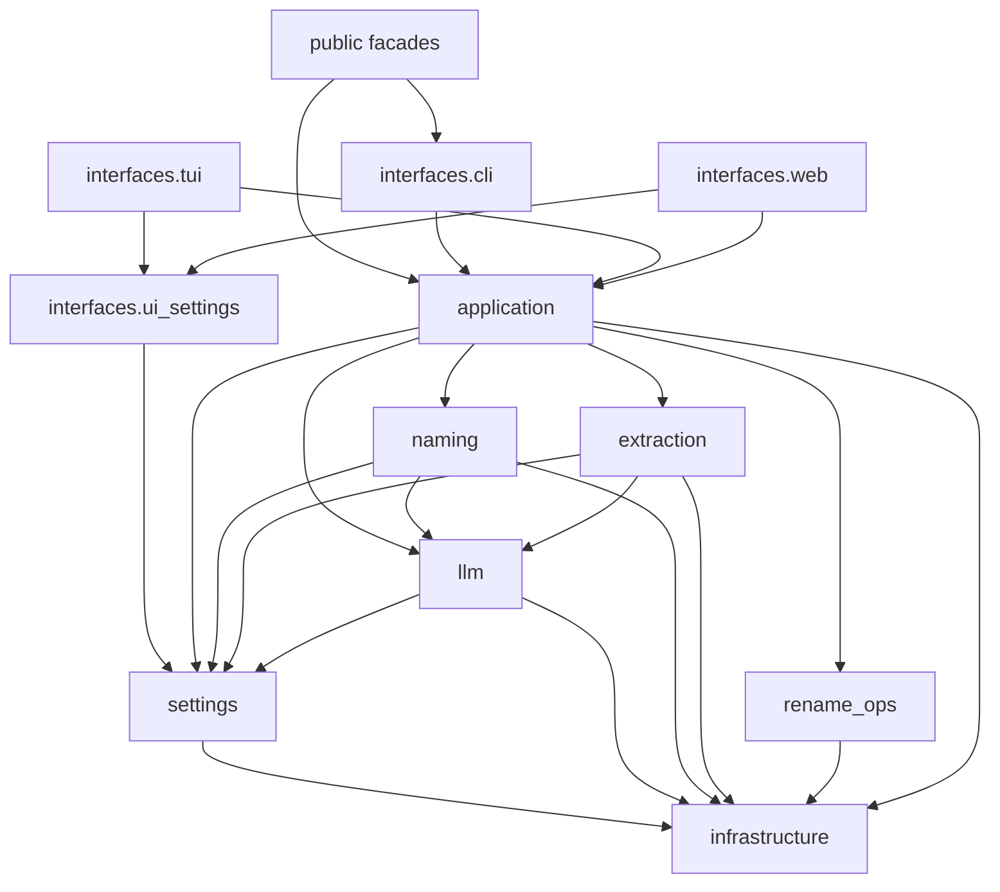
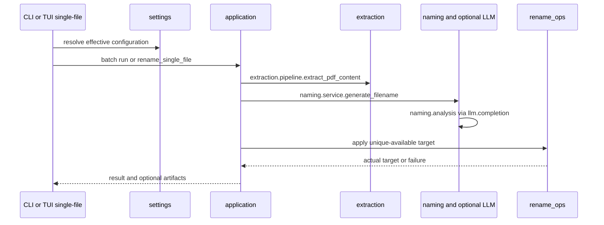
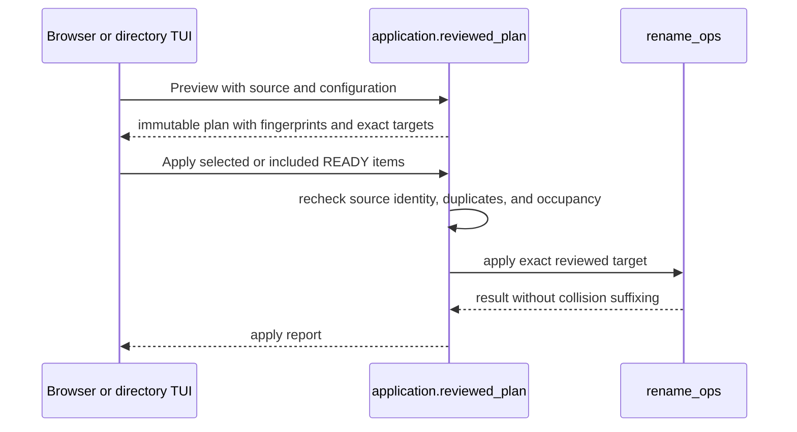

# Folionym architecture

## Scope

Folionym is a modular monolith for supervised local PDF naming. One installed
Python distribution provides four console entry points. The loopback browser
interface is a React application built into that same distribution, not a
separate backend service.

The system keeps proposal calculation separate from filesystem mutation.
Settings, extraction, naming, and optional LLM work produce a proposed name. An
interface then either reports the proposal or authorizes one of the two
supported apply policies.

## System context

The Python process runs with the current operating-system account. The browser
server binds to `127.0.0.1` and keeps its runs, reviewed plans, reports, and
bounded event history in memory. The LLM endpoint and post-rename hook are
separate network trust boundaries described in [SECURITY.md](SECURITY.md).

The optional static Pages build is a deterministic simulation. It has no backend,
does not read PDFs, and cannot rename files. Its source is shared with the browser
client, but its runtime sits outside the local application topology.

## Components

| Component | Responsibility |
| --- | --- |
| `infrastructure` | leaf primitives: private files, path and filename safety (`filenames`), URL policy and safe HTTP posts, logging, errors, token counting, and packaged resources |
| `settings` | `RenamerConfig`, presets, validation, environment names, and the one precedence table |
| `llm` | how to talk to a model: protocols, HTTP transport, response cache, JSON completion (`completion`), and response parsing |
| `extraction` | reading and writing PDFs: text, metadata, OCR, page rendering, the vision prompt, and the extraction pipeline |
| `naming` | what to ask a model and how to turn answers plus heuristics into a filename: scoring, dates, templates, tokens, document analysis, and the `generate_filename` service |
| `rename_ops` | guarded renames: collision policy, backups, atomic rename attempts, and cross-filesystem fallback |
| `application` | use cases: discovery, proposals, scheduling, batch and watch runs, reviewed plans, undo, single-file rename, artifacts, and hooks |
| `interfaces` | adapters that parse input and present output: `cli` (including terminal prompts and summary), `tui`, `web`, and the shared `ui_settings` snapshot |
| `frontend` | React/TypeScript browser routes and components built by Vite |

The top-level modules `folionym.config`, `folionym.filename`,
`folionym.heuristics`, `folionym.renamer`, and `folionym.rename_ops` are stable
compatibility facades. `folionym.rename_ops` is a package; the other four are
composition roots over the owning packages, and `folionym.renamer` also composes
the CLI terminal adapter (`interfaces.cli.terminal`) to keep its interactive
behavior. Adding another facade requires an intentional public contract.

## Dependency direction

The diagram omits edges that follow transitively (for example, every adapter may
also import `settings`, `extraction`, `naming`, `llm`, and `infrastructure`
directly). `scripts/check_architecture.py` holds the exact allowlist, and
`make architecture-check` enforces it:

- `infrastructure` imports no other Folionym package;
- `settings` imports only `infrastructure`; `llm` imports `settings` and
  `infrastructure`;
- `naming` and `extraction` import `llm`, `settings`, and `infrastructure`; they
  do not import each other, `application`, `rename_ops`, or `interfaces`;
- `rename_ops` imports only `infrastructure`;
- `application` imports every domain package but never `interfaces`;
- `interfaces.cli`, `interfaces.tui`, and `interfaces.web` import `application`
  and the domain packages except `rename_ops`, so renames always go
  through `application`; sibling adapters never import each other, and only `tui`
  and `web` may share `interfaces.ui_settings`;
- the public facades are composition roots and no internal package imports them;
  `folionym.renamer` additionally imports `interfaces.cli`;
- no package imports another owner's `_private` names, and framework or transport
  libraries (FastAPI, Textual, Rich, `requests`, PyMuPDF, OCRmyPDF, tiktoken) stay
  in the packages that own them.

`naming` orchestrates model calls through an injected completion client; the
transport itself is constructed outside `naming`, in `llm.http` or the composing
caller. That keeps the domain usable without FastAPI, Textual, PyMuPDF, OCRmyPDF,
or an active LLM endpoint unless the corresponding feature is selected.

## Where new code belongs

- Filename or path safety, private file writes, URL policy, logging: `infrastructure`.
- Configuration fields, environment names, presets, precedence: `settings`.
- Model transport, response cache, JSON completion and parsing: `llm`.
- PDF reading or writing, OCR, rendering, vision prompt: `extraction`.
- Prompts, heuristics, dates, templates, filename composition: `naming`.
- Renames, collision policy, and backups: `rename_ops`. Optional in-place PDF
  metadata writes: `extraction.writer`.
- A new workflow or use case shared by interfaces: `application`.
- Prompts, parsing, rendering, and routes for one surface: `interfaces.<adapter>`.

A new cross-package import needs an edit to `ALLOWED_DEPENDENCIES`; see
[CONTRIBUTING.md](CONTRIBUTING.md).

## Principal flows

### Conventional CLI and immediate single-file flow

The CLI runs through `application.batch`, with prompts, progress, and the run
summary supplied by the terminal adapter `interfaces/cli/terminal.py`. The TUI
single-file rename calls `application.single_file`. `application.undo` and
`application.rename_log` implement `folionym-undo` from the tab-separated rename
log. Conventional CLI dry run and apply are independent runs, so the proposal may
change between invocations. `--plan-file` writes an export and is not accepted
later as reviewed-plan input.

### Reviewed browser and directory-TUI flow

The browser and directory TUI adapt the same reviewed-plan contract. A material
TUI source or settings edit invalidates the retained plan, and an incomplete or
cancelled Preview cannot be applied. TUI single-file rename deliberately uses the
conventional unique-available policy instead.

## State and outputs

`RenamerConfig` is the canonical runtime configuration. CLI configuration is
resolved for each invocation. The TUI and browser share form state in
`~/.folionym_ui.json`, written atomically with private permissions where the
platform supports them.

Browser `RunRegistry` state, plans, reports, cancellation flags, and server-sent
event history are process-local and bounded. Completed runs expire after one hour
or beyond 32 retained runs; active operations pin their plans. Each run keeps 256
recent events, with a current-state snapshot for older reconnect cursors.
Restarting `folionym-web` discards them.

Optional outputs are independent artifacts, not a plan database:

- backup copies;
- tab-separated rename logs used by `folionym-undo`;
- JSON or CSV proposal plans;
- metadata exports;
- summary JSON;
- persistent LLM response-cache JSON.

Treat these outputs as document-adjacent private data.

## Build and distribution boundary

`frontend/` is independently type-checked and built with npm, but it ships as part
of the Python distribution. A normal Vite build writes generated assets to
`src/folionym/web_dist/`; the wheel must contain those assets and the bundled data
files. `make release-check` validates the lock, frontend build, repository
hygiene, architecture, Python formatting and linting, types, tests, source and
wheel distributions, and installed console entries.

The static demo uses a separate Vite mode and writes ignored `dist-demo/`.
Deployment, when enabled, is handled by the Pages workflow and does not deploy
the Python application.

## Invariants and extension points

- Existing targets are never overwritten.
- Exact reviewed Apply never substitutes a different target.
- Backups are created before mutation and use private permissions where
  supported.
- Cross-filesystem fallback validates its reserved destination before removing
  the source and cleans incomplete targets after failure.
- New interfaces adapt application contracts instead of reimplementing rename
  policy.
- New LLM transports implement the provider-neutral protocol and keep network
  construction outside `naming`.
- New generated naming fields belong in the naming request and template model;
  filesystem policy remains in `rename_ops`.

Folionym does not provide accounts, remote authentication, document storage, a
hosted rename API, a database-backed plan store, or coordinated multi-process
writers.

See [ADR 0001](docs/decisions/0001-rename-filesystem-boundary.md) for the
filesystem boundary and
[ADR 0002](docs/decisions/0002-modular-monolith-boundaries.md) for the modular
monolith and shared reviewed-plan decision, and
[ADR 0003](docs/decisions/0003-responsibility-based-module-boundaries.md) for
responsibility-based module ownership and the allowlist.
