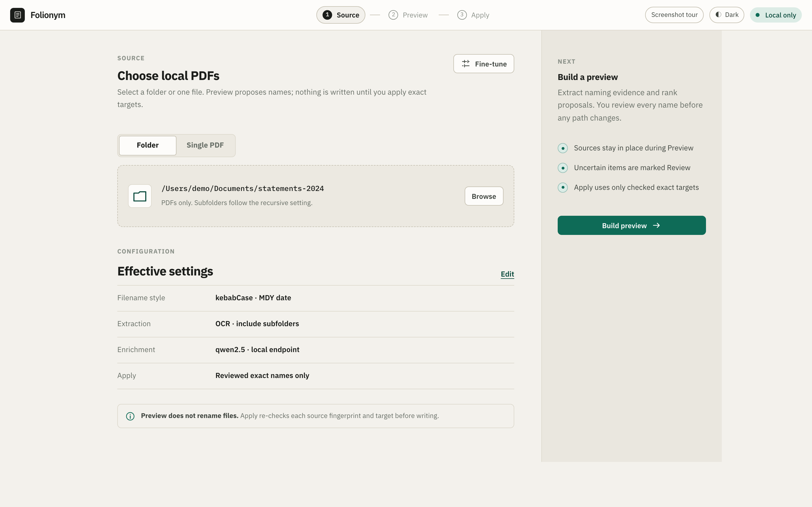
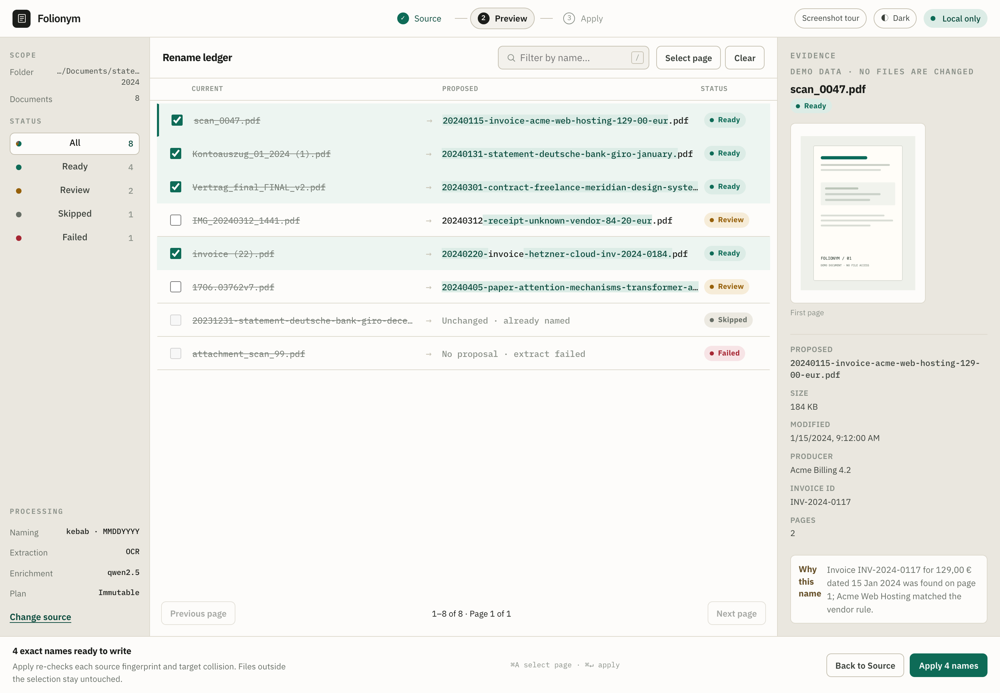
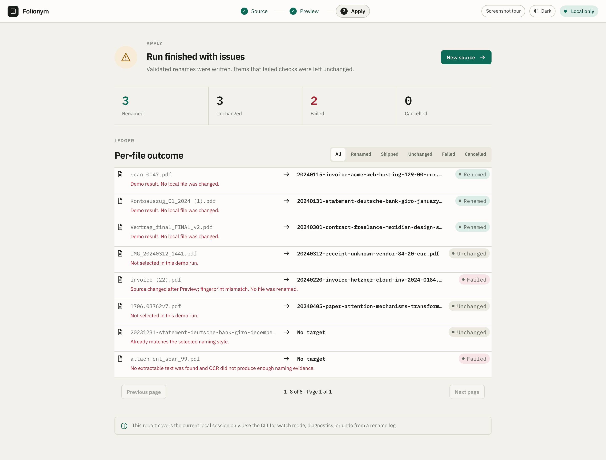
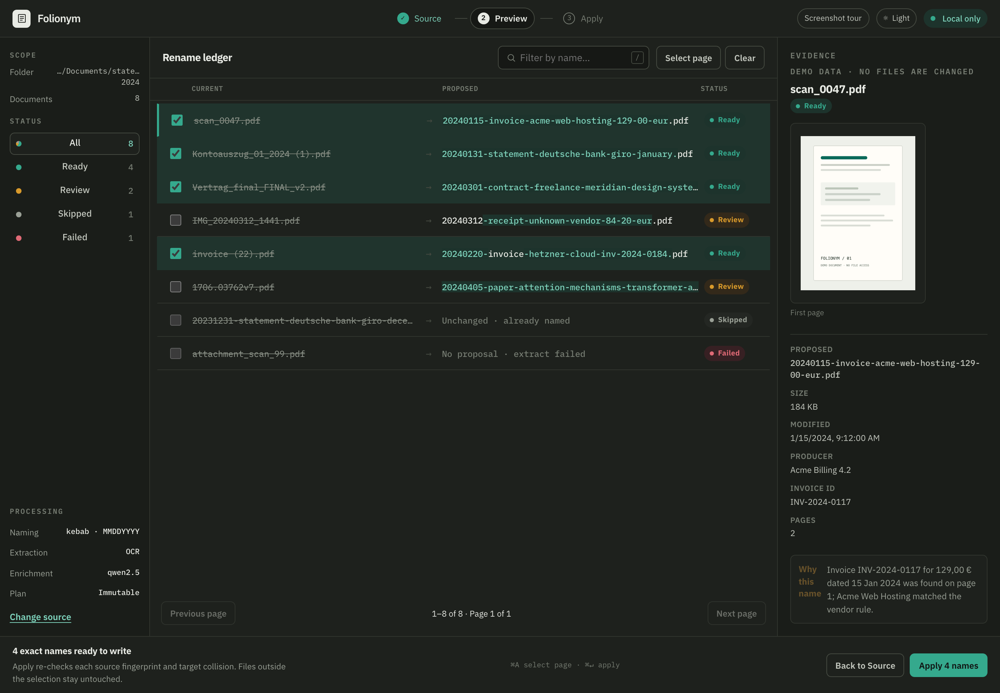

# Browser interface

Install the browser and PDF extras, then start the loopback service:

```bash
python -m pip install -e '.[web,pdf]'
folionym-web
```

It serves the packaged React application at `http://127.0.0.1:8765/source`. Use
`folionym-web --port 9000 --no-open` to choose another loopback port. There is no
supported remote, multi-user, container, or hosted deployment.

## Screenshot tour

| Source | Preview |
| --- | --- |
|  |  |

| Apply report | Dark theme |
| --- | --- |
|  |  |

The [live demo](https://sebastianspicker.github.io/folionym/) reproduces these
screens with simulated documents.

## Reviewed workflow

1. **Source** selects one PDF or a directory and supplies naming, extraction,
   endpoint, and output settings.
2. **Preview** creates a process-local immutable plan of source-to-target
   proposals. It does not rename files.
3. **Apply** confirms selected reviewed targets and never generates names again.

Before a rename, the application checks the source fingerprint, duplicate
selected targets, and exact target availability. A changed source or an occupied
target fails the rename; the system does not pick a suffixed replacement. Only
one browser operation runs at a time. Cancellation is cooperative, and plans and
reports disappear when the server process stops.

## Large folders and connection recovery

Preview and report ledgers show 50 rows per page. Selection survives page and
filter changes. *Select page* and the select-all keyboard shortcut operate on
the current page; the Apply confirmation includes every retained selection,
including rows on other pages.

The ledger loads lightweight immutable summaries. Selecting a row loads its
metadata and current file details separately. If a source changed after Preview,
you need a new Preview before its evidence or thumbnail can load. Thumbnails
stay in a bounded process-memory cache and are never written to disk.

Progress uses server-sent events with periodic status checks and polling as a
fallback. After five consecutive failed status requests, automatic retries
pause; *Retry connection* resumes checking the same operation. Losing the
connection does not cancel filesystem work.

The folder picker caches up to 20 listings for 10 seconds, and *Refresh*
bypasses the cache. Child-folder PDF counts are deferred until you open a
folder, so a listing does not scan every child directory. Counts exclude
symbolic-link PDFs, matching what a depth-one Preview discovers.

The server retains up to 32 completed runs for one hour and 256 events per run.
Active operations keep their inputs. An expired or evicted plan needs a new
Preview. A reconnect older than the retained events receives the current
snapshot.

## Runtime map

| Path | Responsibility |
| --- | --- |
| `frontend/` | React, TypeScript, and Vite source |
| `frontend/src/App.tsx` and `frontend/src/pages/` | browser workflow and routes |
| `frontend/src/components/` | shared browser components |
| `src/folionym/interfaces/web/cli.py` | loopback Uvicorn launcher |
| `src/folionym/interfaces/web/app.py` | HTTP boundary, filesystem navigation, API, static files, and headers |
| `src/folionym/interfaces/web/runtime.py` | one active run, events, cancellation, plans, and reports |
| `src/folionym/application/reviewed_plan.py` | shared preview creation and exact reviewed Apply |
| `src/folionym/interfaces/ui_settings.py` | browser and TUI settings persistence |
| `src/folionym/web_dist/` | Vite output included in the wheel |

Vite development uses `127.0.0.1:5173` and proxies `/api` to the loopback
service. The production build writes to `src/folionym/web_dist/`.

## GitHub Pages demo

The repository includes a deterministic static-demo build for GitHub Pages.
When Pages is enabled for Actions and the Pages workflow has deployed, the demo
is at `https://sebastianspicker.github.io/folionym/`. It uses no PDF files,
loopback service, or backend API requests: Source, Preview, and Apply work
against in-browser mock data, and Apply reports simulated outcomes without
changing files. A `tour.html` page on the same site adds the screenshot tour
shown above.

Build it separately from the packaged application:

```bash
cd frontend
npm run build:demo
```

This writes `dist-demo/` with the project base `/folionym/`, a `404.html`
fallback for route refreshes, and copies the screenshot tour from `docs/`. It
never writes `src/folionym/web_dist/`. The *Pages demo* workflow validates this
build on pull requests and is configured to deploy it from `main` or a manually
dispatched run. The repository's Pages source must be set to **GitHub Actions**
before its first deployment. Inspecting the repository alone does not prove that
Pages is enabled or that the URL is currently live.

## Local security boundary

The server accepts loopback `Host` values only. API requests require a
process-local HTTP-only same-site cookie, and mutating requests must be
same-origin JSON. Documentation and OpenAPI routes are disabled. Responses use a
restrictive content security policy, `no-store` cache headers, and framing
protection.

These controls do not turn the service into a remote authentication system. A
non-loopback LLM endpoint or post-rename hook can receive document-derived
content. The browser requires acknowledgement before the first Preview for each
external endpoint. See [SECURITY.md](../SECURITY.md).

The browser and TUI share `~/.folionym_ui.json`; on POSIX, the application uses
owner-only writes where supported. An existing `~/.folionym_tui.json` is
migrated without deleting the old file.

## Development

Start the loopback backend in one terminal:

```bash
folionym-web --no-open
```

Then, from a second terminal, work in `frontend/`:

```bash
npm run typecheck
npm test
npm run test:browser
npm run dev
```

From the repository root, build the packaged application and run the release
gate with:

```bash
make frontend-check
make release-check
```

The release gate verifies the packaged `web_dist` asset through an isolated
installed-wheel check.

`npm test` uses Node's test runner and the installed TypeScript compiler.
`npm run test:browser` runs real React hooks and components in an installed
Chromium browser with a disposable profile; it downloads no browser or test
framework. Set `FOLIONYM_BROWSER` to the executable if it is not discovered.
`node tests/capture-screenshots.mjs` regenerates the tour images in
`docs/screenshots/` from the demo build.
